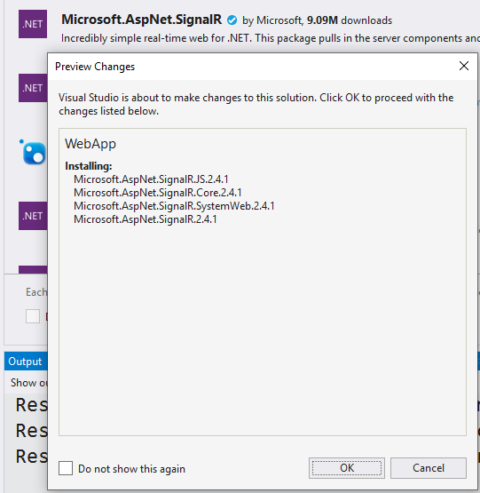

# Learn SignalR

> SignalR is available for both the .Net Framework and .Net Core. You can learn about the differences [here](https://docs.microsoft.com/en-us/aspnet/core/signalr/version-differences?view=aspnetcore-3.0). This repository explores [SignalR](https://docs.microsoft.com/en-us/aspnet/signalr/overview/getting-started/tutorial-getting-started-with-signalr-and-mvc) for the **.Net Framework** 4.7.2.

## NuGet Packages

